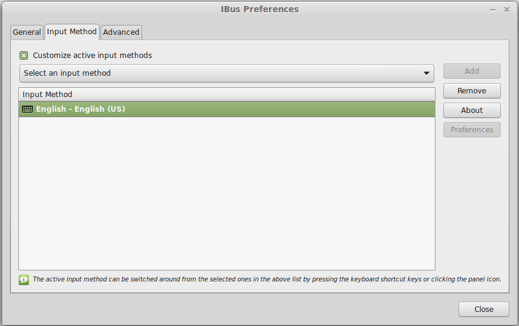
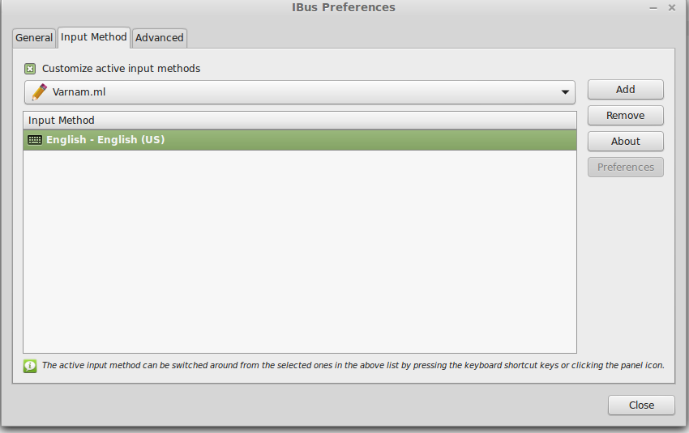

###Configuring input tools

Inorder to start using varnam to write everything from emails to presentations, you need to configure your input tools. Varnam currently supports [ibus](http://en.wikipedia.org/wiki/Intelligent_Input_Bus).

What is I-BUS? Intelligent input BUS.
What does it do? Helps us type alphabets other than the latin ones. By default your computer can support English, Spanish, French and similar languages. But try to type in Hindi or Chinese and you'd see that it is not as easy as it should be. That's where I-BUS can help. I-BUS maps the keys you press on keyboard to specific symbols (of another language) on the screen.

####Setting up I-BUS

#####Requirements

You need to have the following packages installed :

+ libibus-dev >= 1.5.
+ glib. Try `sudo apt-get install libglib2.0-0`
+ libvarnam. Already installed if you had followed the instructions [here](guide_getting_started.md)
+ ibus-qt4 or ibus-gtk3 or ibus-gtk depending on your linux flavor. If you're unsure, install ibus-gtk3. `sudo apt-get install ibus-gtk3` 
+ git [optional]. We need this to clone the source code hosted at github. `sudo apt-get install git`

#####Make I-BUS the default input method

If you've installed the above packages, ibus should be installed in your computer. You should see a 'keyboard' icon on your sysem tray (bottom right). If there's no such icon, try restarting your computer.

Change your default input method to ibus. Searching for 'input method' from dashboard(ubuntu) or the menu(cinnamon/linux mint and KDE/kubuntu) can directly take you to the settings.

#####Adding varnam to ibus

whoa! We're here finally!

First you need to download and install the varnam I-BUS engine. If you do not have git installed, go [here](https://github.com/varnamproject/libvarnam-ibus) and download the zip version.
If you do have git installed, typing `git clone https://github.com/varnamproject/libvarnam-ibus.git`  on the terminal will automatically download it into a directory for you.

Now that you've downloaded the engine, `cd` to that directory on your terminal and type in the following commands one after the other :

`cmake .`
`make`
`sudo make install`

That should configure and install the varnam ibus engine on your linux machine. Now restart your computer (or restart I-BUS by right clicking on its tray icon and choosing 'restart').

To add varnam to I-BUS, right click on the ibus tray icon and choose `preferences`.

Go to the `Input Method` tab and click on `select an input method`. You will see a lit. However, you will not see Malayalam or Hindi or any of the 'varnam' languages by default. To view them, click `show all input methds` and scroll down. If it is Malayalam that you want, move mouse over `malayalam` and from the resulting menu, choose `varnam.ml`

For adding another language, navigate to the appropriate varnam.<language_code> entry in the list. For example, to add Hindi, go to Hindi->varnam.hi and add it.

Finally, press the add button to add malayalam to ibus.

#####Typing in your language of choice

Now all you have to do is left click on the I-BUS tray and choose your language of choice. Better yet, press ctrl+space on the keyboard to instantly switch languages. Open a text editor (gedit would be great) and start typing. You should see varnam suggesting words corresponding to your keystrokes. No? Then you've missed a step or two somewhere. No? Then I've probably missed a thing or two when I wrote this. As before, you can seek help from the [mailing list](https://lists.nongnu.org/mailman/listinfo/varnamproject-discuss) or _#varnamproject_ at Freenode.

######[Next](guide_adding_word_corpus.md)
######[Prev](guide_getting_started.md)

